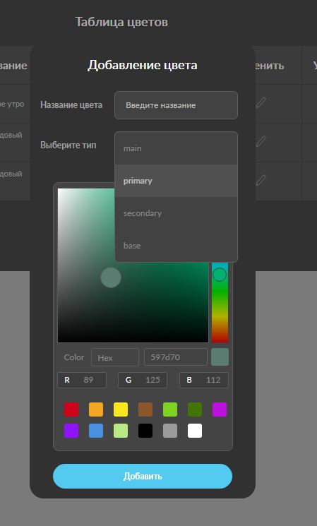

# BLEND4WEB-TEST-TASK

Color table test task.
Requirments: CRUD app, with Drag&Drop and persistance functionality (state persists only after clicking save button).
App should not depend on any frameworks, and should be written with use of Web Components API.
Main feature of an app is a color picker, which allows user to pick colors in different formats.




## Technology Stack

Main technologies of the project:

- [JavaScript](https://developer.mozilla.org/en-US/docs/Web/JavaScript) - main language of the project
- [Webpack](https://webpack.js.org/) - build tool
- [Web Components](https://developer.mozilla.org/en-US/docs/Web/Web_Components) - web API for custom HTML element creation
- [CSS](https://developer.mozilla.org/en-US/docs/Web/CSS) - stylesheet language

## Install / Local Set Up

```sh
npm install
npm run dev
```

## Build

```sh
npm install
npm run build
```
